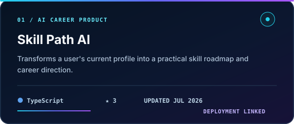
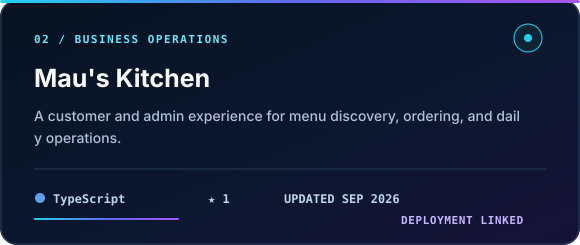
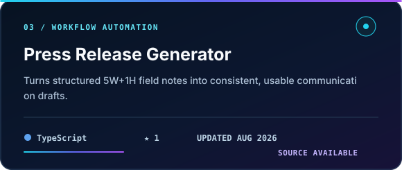
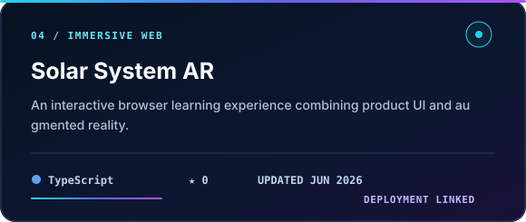
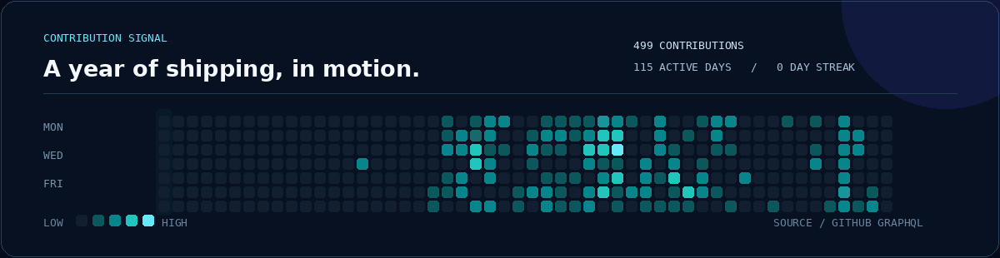

  

   

  <a href="https://sutan.dev"><strong>PORTFOLIO</strong></a>
  &nbsp;&nbsp;／&nbsp;&nbsp;
  <a href="https://github.com/Sutannn13?tab=repositories"><strong>PROJECTS</strong></a>
  &nbsp;&nbsp;／&nbsp;&nbsp;
  <a href="mailto:sutanarliejohan@gmail.com"><strong>EMAIL</strong></a>
  &nbsp;&nbsp;／&nbsp;&nbsp;
  <a href="https://www.linkedin.com/in/sutanarliejohan"><strong>LINKEDIN</strong></a>

## `01 / PROFILE`

I am **Sutan Arlie Johan**, an Information Technology student and backend-focused full-stack developer based in Depok, Indonesia.

I turn rough ideas, manual processes, and scattered data into systems that feel clear to the people using them. My work sits between **backend engineering, product thinking, automation, and interface execution**—from data model and API to deployment.

<table>
  <tr>
    <td width="33%" valign="top">
      <strong>NOW / BUILDING</strong>  
      Operational tools, REST APIs, and useful web products.
    </td>
    <td width="33%" valign="top">
      <strong>NEXT / IMPROVING</strong>  
      Testing, system design, realtime data, and deployment workflows.
    </td>
    <td width="34%" valign="top">
      <strong>OPEN / OPPORTUNITIES</strong>  
      Junior roles, internships, and focused product collaborations.
    </td>
  </tr>
</table>

## `02 / SELECTED SYSTEMS`

<table>
  <tr>
    <td width="50%" valign="top">
      
       
      <a href="https://github.com/Sutannn13/Skill-Path-AI"><strong>Source</strong></a> · <a href="https://skill-path-ai-kappa.vercel.app"><strong>Live product ↗</strong></a>
    </td>
    <td width="50%" valign="top">
      
       
      <a href="https://github.com/Sutannn13/mau-s-kitchen"><strong>Source</strong></a> · <a href="https://maus-kitchen.pages.dev"><strong>Live product ↗</strong></a>
    </td>
  </tr>
  <tr>
    <td width="50%" valign="top">
      
       
      <a href="https://github.com/Sutannn13/press-release-auto-generate"><strong>Source ↗</strong></a>
    </td>
    <td width="50%" valign="top">
      
       
      <a href="https://github.com/Sutannn13/solar-system-ar"><strong>Source</strong></a> · <a href="https://solar-system-ar-sigma.vercel.app"><strong>Live demo ↗</strong></a>
    </td>
  </tr>
</table>

> Each card is generated from live repository metadata. Language, stars, and last update refresh automatically through GitHub Actions.

## `03 / ACTIVITY OBSERVATORY`

  
    
  

  
<strong>Open weekly coding telemetry / WakaTime</strong>

   

<!--START_SECTION:waka-->
WakaTime telemetry is ready to go live when the repository secret is connected. The rest of this profile keeps updating independently.
<!--END_SECTION:waka-->

## `04 / WORKING STACK`

| Layer | Tools and focus |
|---|---|
| **Backend systems** | `Laravel` `PHP` `REST API` `MySQL` `API testing` |
| **Product interface** | `TypeScript` `JavaScript` `HTML` `CSS` `Tailwind CSS` |
| **Workflow** | `Git` `GitHub Actions` `Postman` `Figma` `Deployment` |
| **Currently extending** | `Supabase` `Realtime systems` `Automated testing` `System design` |

## `05 / PROOF OF WORK`

- **2nd place — UBSI West Java IT Bootcamp**, building the Trash Point web application.
- Registered **HKI inventor** for Trash Point.
- Research contributor to the **SALI App** publication in JITK, accredited **SINTA 2**.
- Certified in **MikroTik MTCNA** and **Cisco Networking** fundamentals.

## `06 / CONTACT`

If you are building a practical web product, backend system, or operational tool, I would like to hear about the problem behind it.

  <a href="mailto:sutanarliejohan@gmail.com"><strong>START A CONVERSATION</strong></a>
  &nbsp;&nbsp;·&nbsp;&nbsp;
  <a href="https://www.linkedin.com/in/sutanarliejohan"><strong>VIEW LINKEDIN</strong></a>

    

  Observe the problem · Design the flow · Ship the system

