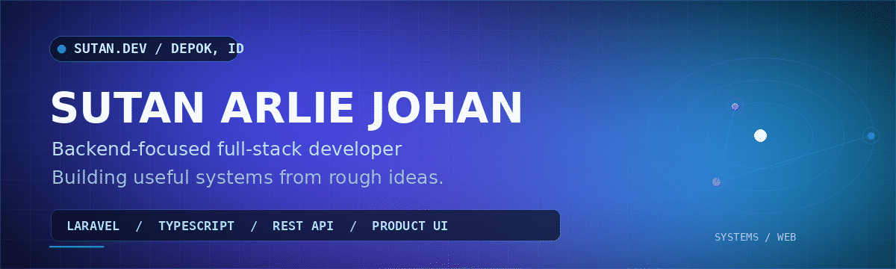
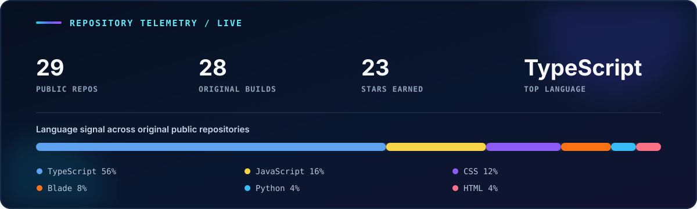

  

   

  <a href="https://sutan.dev"><strong>Portfolio</strong></a>
  &nbsp;·&nbsp;
  <a href="mailto:sutanarliejohan@gmail.com"><strong>Email</strong></a>
  &nbsp;·&nbsp;
  <a href="https://www.linkedin.com/in/sutanarliejohan"><strong>LinkedIn</strong></a>
  &nbsp;·&nbsp;
  <a href="https://github.com/Sutannn13?tab=repositories"><strong>Repositories</strong></a>

## Profile

I am a seventh-semester **Information Technology student at UBSI Margonda** and a backend-focused full-stack developer based in Depok, Indonesia.

I like work where the input is messy—manual processes, scattered data, or an unclear system flow—and the result needs to feel simple for the person using it. My recent projects cover operational tools, REST APIs, community platforms, and interactive web experiences.

- Building with **Laravel, PHP, TypeScript, JavaScript, MySQL, and Tailwind CSS**.
- Comfortable moving from **data model → API → interface → deployment**.
- Currently improving practical skills in API design, database structure, testing, and product-oriented UI.
- Open to junior developer opportunities, internships, and focused project collaborations.

## Current work

| Project | What I am solving | Main tools |
|---|---|---|
| **Mau's Kitchen** | A clearer customer and operations flow for a family food business. | TypeScript, web operations |
| **Press Release Generator** | Turning structured 5W+1H field notes into a usable first draft for communications work. | TypeScript, workflow design |
| **Jakarta Tech Expo** | A responsive event experience built within a strict static-web stack. | HTML, Tailwind CSS, JavaScript |

## Selected projects

<table>
  <tr>
    <td width="50%" valign="top">
      <h3>Skill Path AI</h3>
      
A career-planning product that turns a user's current profile into a skill roadmap and relevant job direction.

      
<code>TypeScript</code> <code>Product workflow</code> <code>GitHub data</code>

      <a href="https://github.com/Sutannn13/Skill-Path-AI">Repository</a> ·
      <a href="https://skill-path-ai-kappa.vercel.app">Live product</a>
    </td>
    <td width="50%" valign="top">
      <h3>Mau's Kitchen</h3>
      
A customer and admin web experience for menu discovery, ordering, and day-to-day small-business operations.

      
<code>TypeScript</code> <code>Full-stack</code> <code>Product UI</code>

      <a href="https://github.com/Sutannn13/mau-s-kitchen">Repository</a> ·
      <a href="https://maus-kitchen.pages.dev">Live product</a>
    </td>
  </tr>
  <tr>
    <td width="50%" valign="top">
      <h3>Press Release Generator</h3>
      
A structured writing workflow for producing consistent press-release drafts from event facts and quotations.

      
<code>TypeScript</code> <code>Automation</code> <code>Content workflow</code>

      <a href="https://github.com/Sutannn13/press-release-auto-generate">Repository</a>
    </td>
    <td width="50%" valign="top">
      <h3>Solar System AR</h3>
      
An interactive browser-based solar-system learning experience that combines web UI with augmented reality.

      
<code>TypeScript</code> <code>A-Frame</code> <code>AR.js</code>

      <a href="https://github.com/Sutannn13/solar-system-ar">Repository</a> ·
      <a href="https://solar-system-ar-sigma.vercel.app">Live demo</a>
    </td>
  </tr>
</table>

## Working stack

| Area | Tools I use |
|---|---|
| **Backend** | `Laravel` `PHP` `REST API` `MySQL` |
| **Frontend** | `TypeScript` `JavaScript` `HTML` `CSS` `Tailwind CSS` |
| **Product & testing** | `Postman` `GitHub` `Git` `Figma` `API testing` |
| **Currently extending** | `Supabase` `Realtime systems` `Deployment workflows` |

## Evidence, not decoration

- **2nd place, UBSI West Java IT Bootcamp** for the Trash Point web application.
- Registered **HKI inventor** for Trash Point.
- Research contributor to the **SALI App** publication in JITK, accredited **SINTA 2**.
- Certified in **MikroTik MTCNA** and **Cisco Networking** fundamentals.

## Live GitHub snapshot

  

  
<strong>Weekly coding pulse</strong> — WakaTime, when connected

   

<!--START_SECTION:waka-->
The workflow is ready. This block will populate automatically when the repository's `WAKATIME_API_KEY` secret is available.
<!--END_SECTION:waka-->

## Let's build something useful

The best way to understand my work is to open a project, follow the problem it solves, and inspect how the pieces connect. If you are working on a practical web product, backend system, or operational tool, reach me through [email](mailto:sutanarliejohan@gmail.com) or [LinkedIn](https://www.linkedin.com/in/sutanarliejohan).

  I care about software that survives contact with real users.

